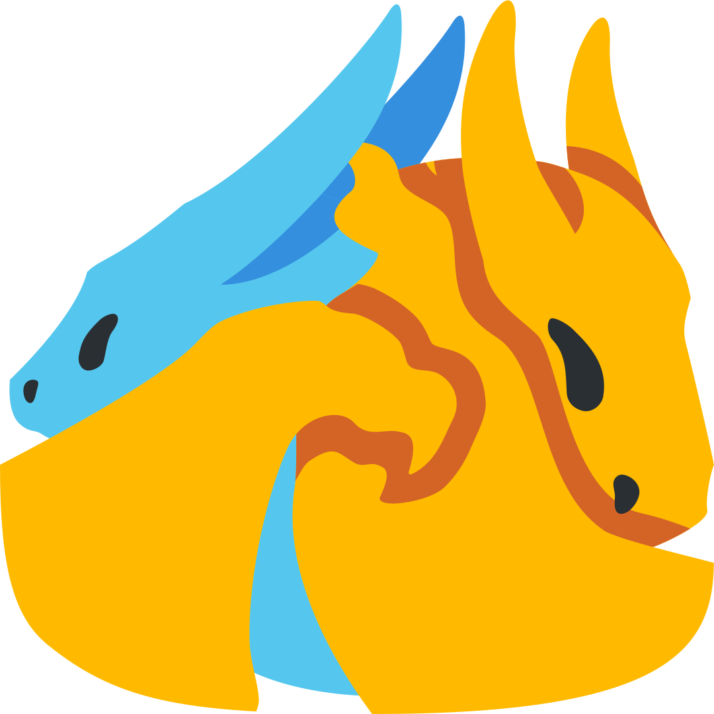
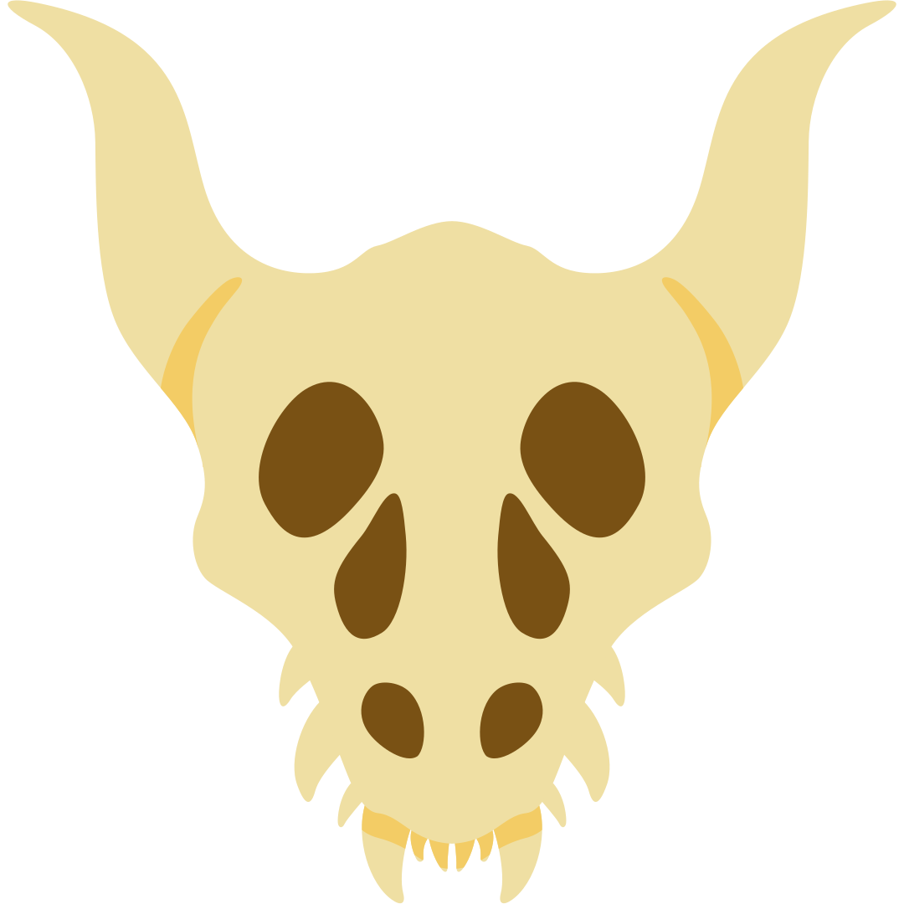
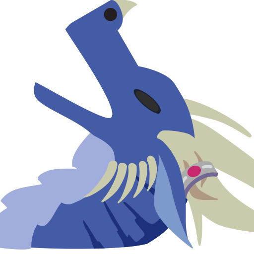
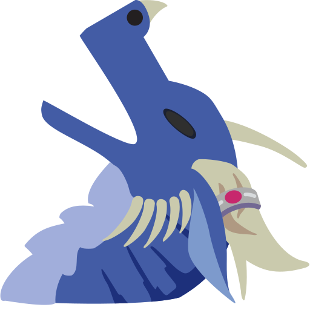

# my dragn emoji

Noto blob- and Twemoji-styled dragon emoji that I've made! Inspired by the [original collection of dragne emoji by khr](https://github.com/chr-1x/dragn-emoji).

## them
(At 48px, or Discord's jumbo emoji size)

### derivatives
Emoji created using khr's as a template; licensed under the [same license as khr's emoji](https://github.com/chr-1x/dragn-emoji/tree/master/LICENSE.md).

## notes
* [dragnwinghug.svg](dragnwinghug.svg) contains all variations of the wing hug, including the color changes and human variants. Human variants can be shown by hiding/showing various groups/paths under the group titled "masked group" (which is inside the layer "content") in a vector editor.